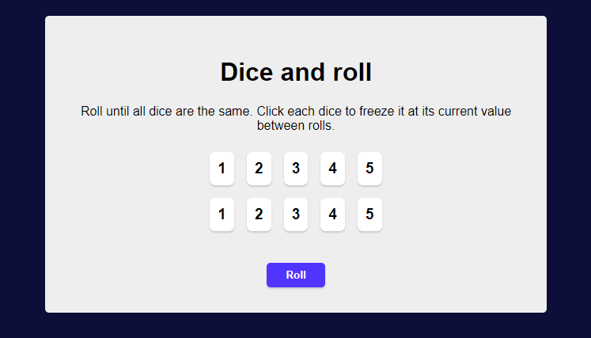

# Click and Roll Game

# hosted link
https://click-and-roll-game-mykel.netlify.app/

## The challenge
The challenge is to build a game where users can

- View the optimal layout for the site depending on their device's screen size
- Numbers brgin to change when the roll button is clicked
- Numbers freeze when the dice buttons are clicked
- Display a winning score when all numbers are the same value.
- Timer startes when the roll button is clicked
- Timer ends when the dice buttons are clicked and are the same

